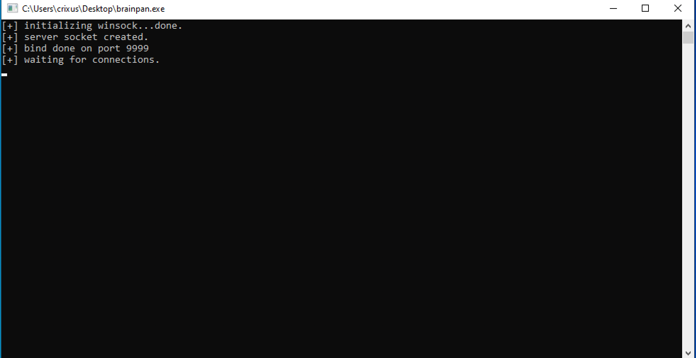
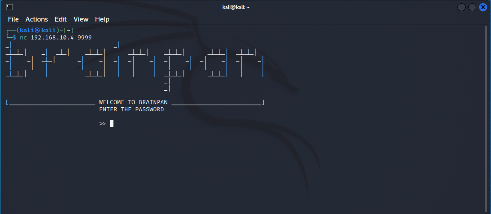
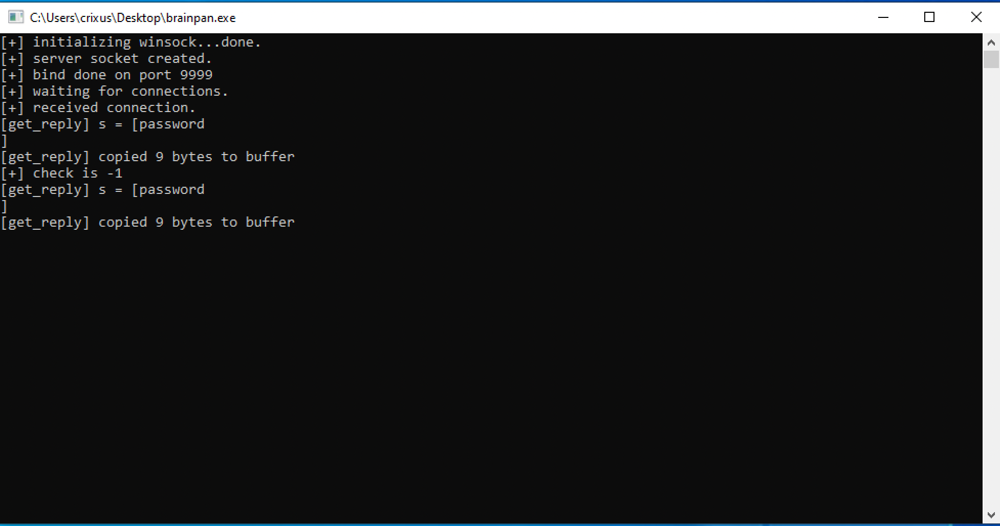
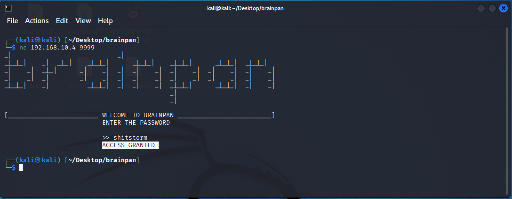
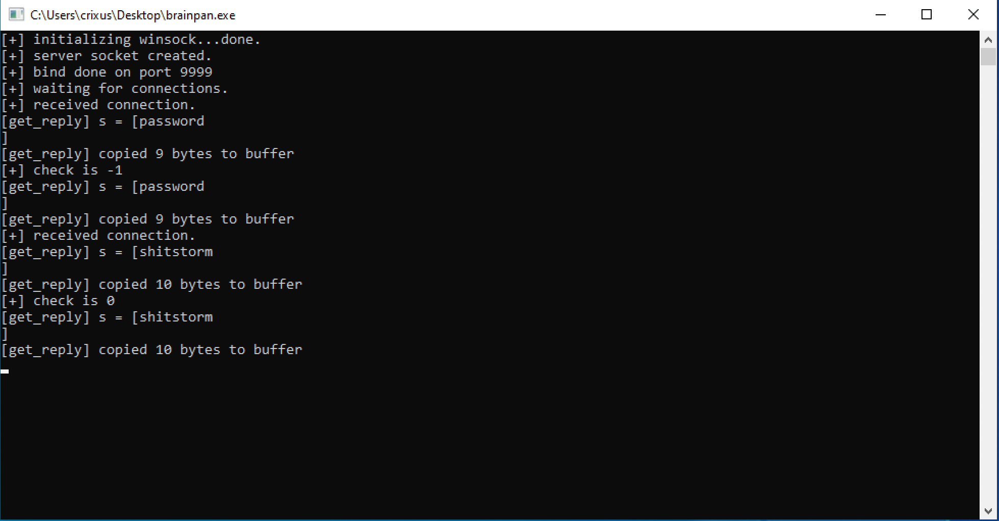

**What is the Purpose of brainpan.exe?**

[Brainpan.exe](https://github.com/cris-m/buffer_overflow_exploit_development/blob/main/assets/resources/brainpan.exe) is an educational tool for security enthusiasts. It's a non-malicious program with vulnerabilities, used to learn about topics like buffer overflows.

I ran the [brainpan.exe](https://github.com/cris-m/buffer_overflow_exploit_development/blob/main/assets/resources/brainpan.exe) file on a Windows machine out of curiosity to understand its functionality.

It's important to emphasize that `brainpan.exe` lacks malicious intent. It operates by listening for incoming TCP connections on port `9999`. From my Linux machine, I attempted to connect to this port, at which point it prompted me for a password. However, I didn't possess the correct password.

I tried various passwords in an attempt to gain access, but all I received in response was an `ACCESS DENIED` message, which left me puzzled.

I decided to investigate what was happening on the Windows side and discovered from the printed messages that the TCP server had indeed received my connection on port `9999` along with the password I provided, which was then copied to a buffer.

My next step was to locate the correct password. While analyzing the binary in Linux using a tool called `strings`, I came across a hard-coded string called `shitstorm`. The resulting string can be found in [brainpan.txt](https://github.com/cris-m/buffer_overflow_exploit_development/blob/main/assets/resources/brainpan.txt).

With this newfound information, I attempted to connect to the TCP server using `shitstorm` as the password, which led to a `ACCESS GRANTED` message. However, the connection was terminated immediately after.

Once again, I returned to the Windows side to observe what was occurring. It became evident that all the input I had been sending to the TCP server was being directly copied into a buffer.

As the input string sent to the TCP server is directly copied into the buffer, it becomes imperative to test the TCP server for potential buffer overflow vulnerabilities.

---

Next, we'll explore the process of [Spiking](https://github.com/cris-m/buffer_overflow_exploit_development/blob/main/assets/documentations/spiking.md)