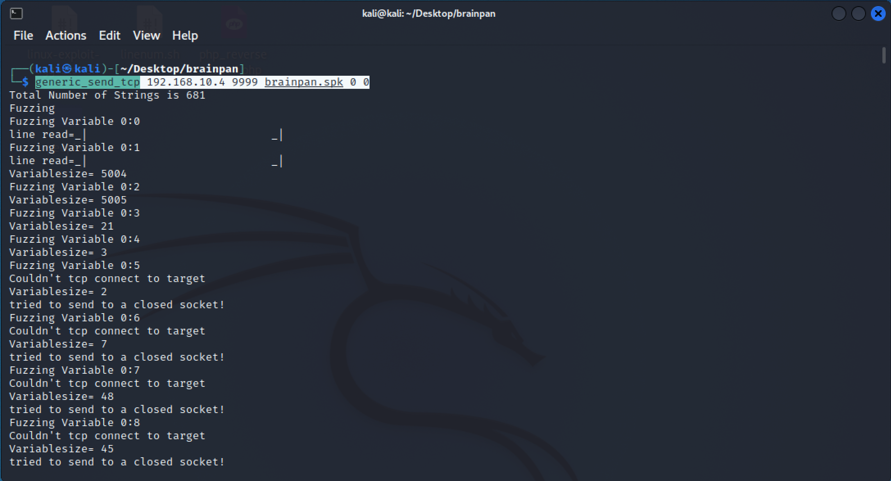
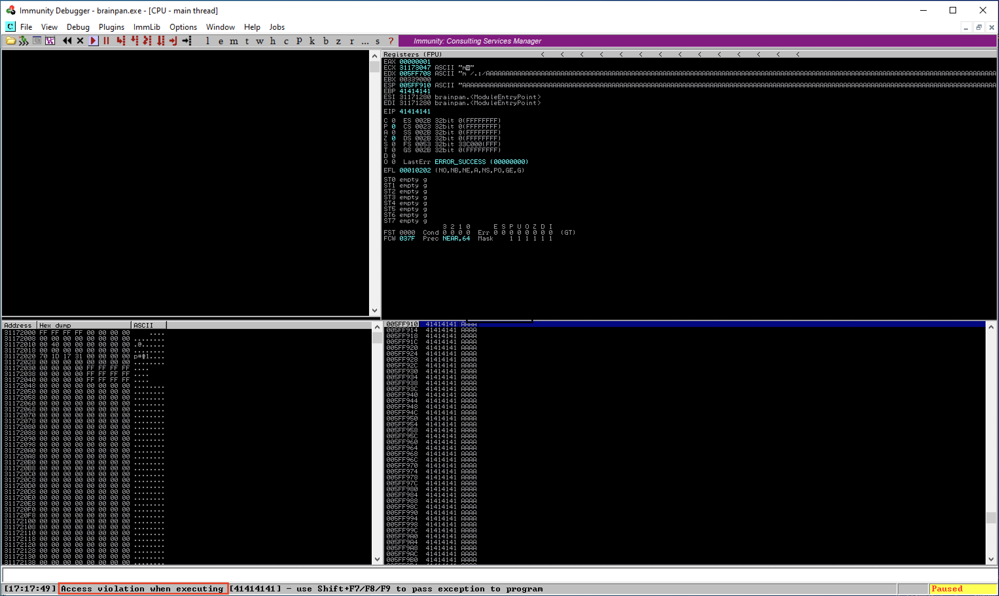

# Spiking

## What is Spiking?

Spiking, much like fuzzing, functions as a method for stress testing protocols. The key distinction lies in its purpose: spiking involves transmitting random data, often garbage, with the intention of probing and potentially compromising a system's security features. In contrast, fuzzing aims to extract meaningful information from the data it sends.

In our case, we will employ the spiking technique to assess the vulnerability of the `brainpan.exe` buffer. This assessment will entail the use of a "spiking script" called [brainpan.spk](https://github.com/cris-m/buffer_overflow_exploit_development/blob/main/assets/resources/brainpan.spk), which will send arbitrary data into the `brainpan.exe` buffer. To execute this, we will utilize the "generic_send_tcp" tool on the Linux side. Concurrently, on the Windows side, we will employ [Immunity Debugger](https://www.immunityinc.com/products/debugger/ "Immunity Debugger website") to monitor and understand the memory-related activities.

The provided spiking script, when run, sends data to the `brainpan.exe` buffer as follows:

```spk
s_readline();
s_string("shitstorm ");
s_string_variable("0");
```

On the Windows side, I attached the `brainpan.exe` process to `Immunity Debugger` and initiated the process.


On the Linux side, I executed the spiking script using `generic_send_tcp`, and the resulting output is depicted below.



Upon script execution, I observed that at a certain point, it failed to establish a connection with the target. Subsequently, I investigated the issue within `Immunity Debugger`, where I encountered an `Access violation notification`.



When an `Access violation` occurs in `Immunity Debugger`, it suggests that there may have been an unauthorized attempt to access or modify memory, potentially involving the `EIP`, `EBP`, or `ESP` components. This situation could present an opportunity for further investigation into potential buffer overflow vulnerabilities, but it does not necessarily confirm the presence of such vulnerabilities or guarantee their exploitation.

---

Next, we'll explore the process of [Fuzzing using Python](https://github.com/cris-m/buffer_overflow_exploit_development/blob/main/assets/documentations/fuzzing.md).