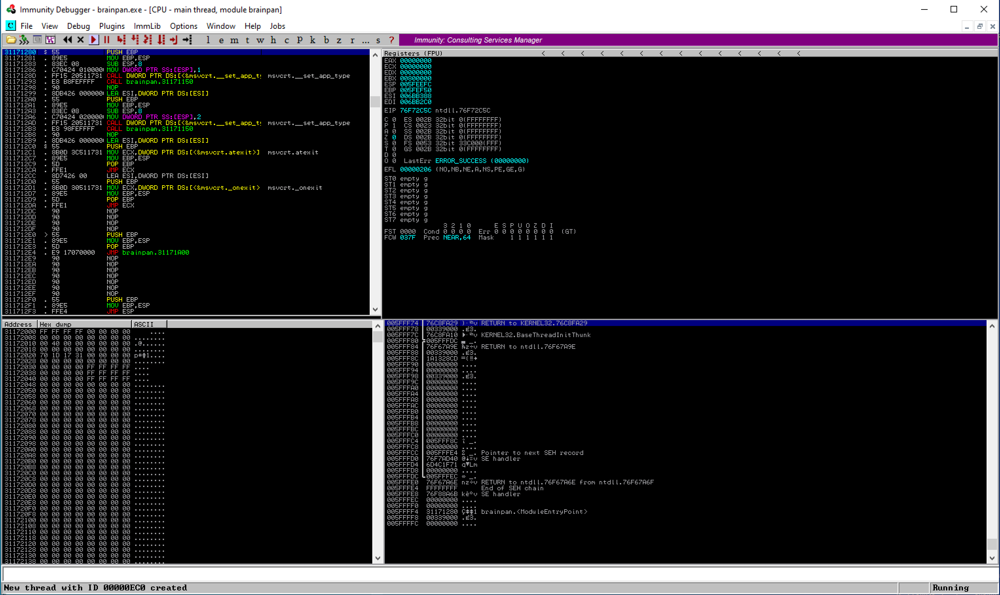

# Spiking

## What is Spiking?

It sends a huge amount of data to a computer system. Spiking is like fuzzing. The difference is that spiking send only garbage data with the aim of bringing down the security features of the system, while fuzzing is intended to get some useful information out of the data it sends.

Now we will use spking technic to check if ``brainpan.exe`` buffer can be overflown. We will use ``spiking script`` in combination with a Linux tool called ``generic_send_tcp`` on Linux side. On Windows side, we will use [Immunity Debugger](https://www.immunityinc.com/products/debugger/ "Immunity Debugger website") to understand what is happening in the memory of our Windows execution.

I write the following ``spinking script`` called [brainpan.spk](https://github.com/cris-m/buffer_overflow_exploit_development/blob/main/assets/resources/brainpan.spk) to send garbage data to ``brainpan.exe`` buffer.

```spk
s_readline();
s_string("shitstorm ");
s_string_variable("0");
```

On windows side I attached ``brainpan.exe`` to ``Immunity Debugger`` and start the process.



On Linux side, I execute the ``spiking script`` in ``generic_send_tcp``. Here is the output I got.


After executing the script, I realized that at some point it could not connect to the target. I went in windows and check what was going on in ``Immunity Debugger``. The saw that there was an ``Access notification`` in ``Immunity Debugger``.


``Access violation`` means that we have overwritten the ``EIP``, ``EBP`` and ``ESP`` parts of the memory and can perform any buffer overflow from now on.

___

New to [Fuzzing using Python](https://github.com/cris-m/buffer_overflow_exploit_development/blob/main/assets/documentations/fuzzing.md)
